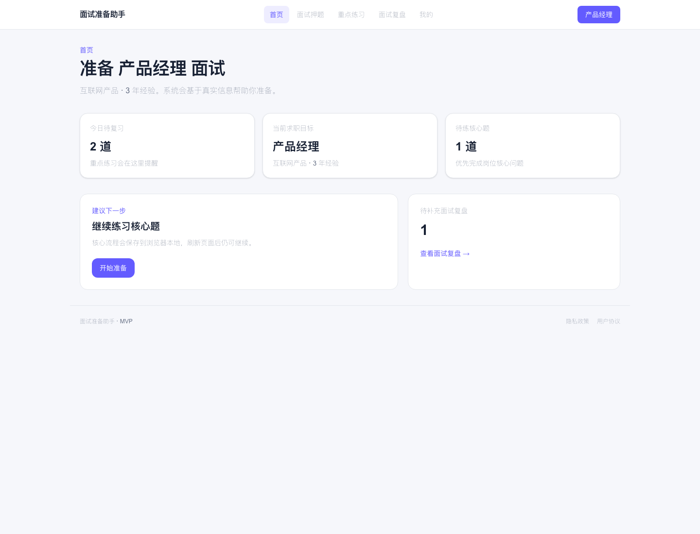
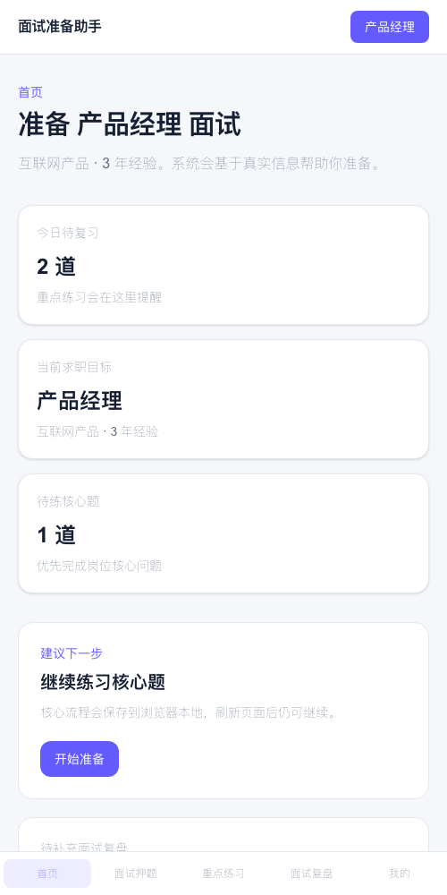
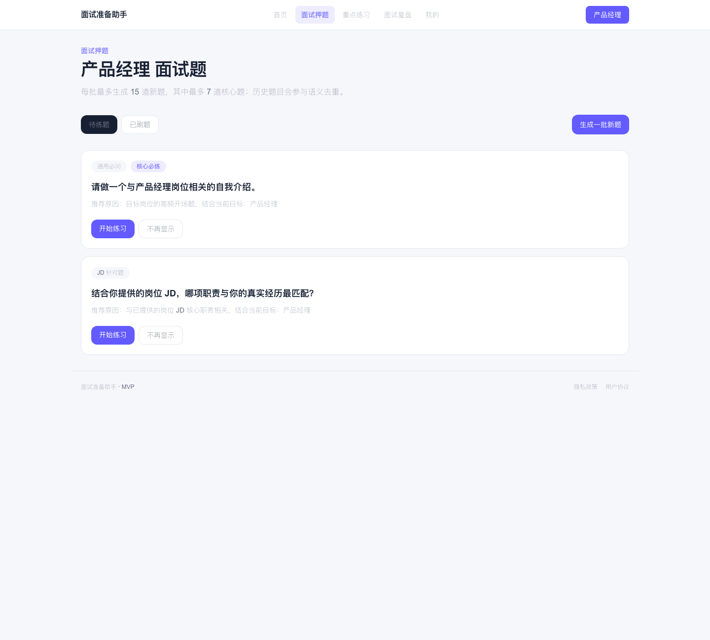
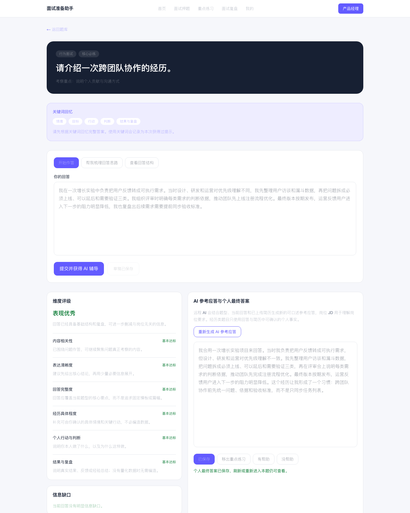
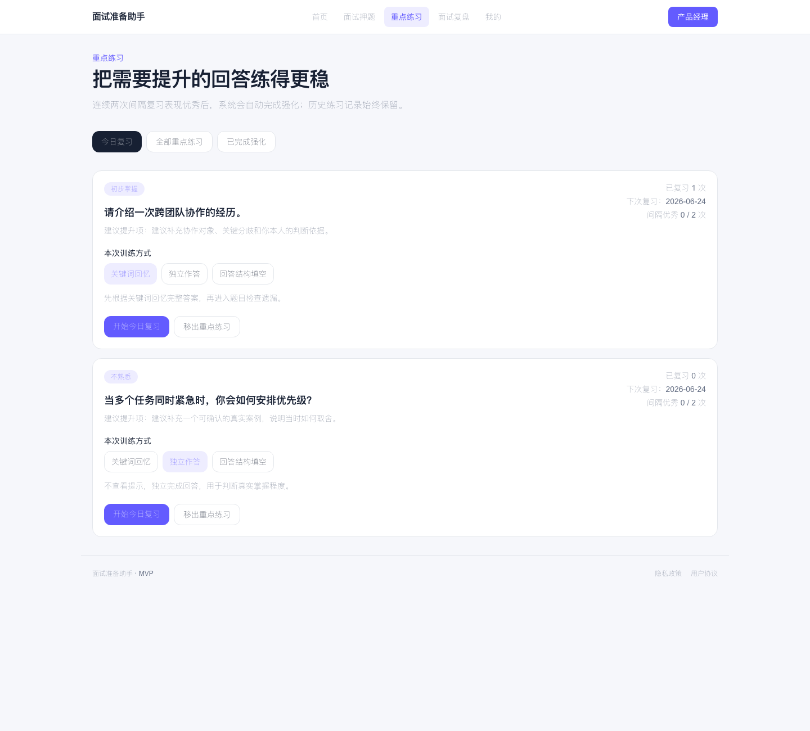

# AI Interview Coach

A responsive web MVP for interview preparation. It helps job seekers generate targeted interview questions, structure answers around real experience, save final answers, practice focus questions, and record real interview retrospectives.

The product principle is simple: AI can organize and improve expression, but it must not invent a user's experience, responsibilities, achievements, or data.

## Access

Live Demo:

```text
https://ai-intervu-two.vercel.app
```

Local Development:

```text
http://localhost:3000
```

The local address only works on the computer running `npm run dev`. For public sharing, deploy the app and add the production URL above and in the GitHub repository's About / Website field.

[](https://vercel.com/new/clone?repository-url=https%3A%2F%2Fgithub.com%2FInnaPanny%2Fai-intervu)

## Product Preview

The screenshots below use fictional demo data and show the main MVP workflow.

### Home Dashboard



The home page is action-oriented: it highlights today's review tasks, the active job target, pending core questions, and the next step to continue preparation.

### Responsive Home



The same priorities are available in a narrow layout with mobile bottom navigation, so the MVP can be used from a phone browser as well as desktop.

### Question Library



The question library keeps generated questions visible until the user chooses to hide them. Core questions are marked, each question explains why it was recommended, and completed questions move into the practiced list.

### Single-Question Practice



The practice page keeps the product's fact boundary visible: AI feedback can identify information gaps and provide a reference answer, but the user must review, edit, and click "确认并保存" before it becomes their personal final answer.

### Focus Practice



Focus practice supports repeated training through keyword recall, independent answering, and structure fill-in. The user decides what enters focus practice, while the system tracks mastery and review timing.

## Features

- Targeted interview question generation for a selected industry, role, and experience level.
- Optional resume and job description context for more relevant questions.
- Semantic deduplication hints across generated questions, hidden questions, practice history, and real interview retrospectives.
- Single-question practice with AI feedback, answer structure, keywords, improvement suggestions, and information gaps.
- User-confirmed final answers: AI reference answers are not treated as personal final answers until the user confirms and saves them.
- Focus practice and review scheduling for questions that need more repetition.
- Real interview retrospective records with question-level classification.
- Responsive Next.js UI for desktop and mobile.

## Privacy Model

This repository does not include personal interview data, resumes, or API keys.

The current MVP stores account and practice data in the browser's `localStorage`, so data stays in the specific browser where it was entered. GitHub only receives source code when you push commits.

Important boundaries:

- `.env.local` is ignored and must never be committed.
- Uploaded resume files are parsed for text in memory by the MVP and are not saved as original files.
- Phone numbers, resumes, answers, retrospectives, and generated practice data are sensitive user data.
- AI calls happen only on the server side.
- AI must mark information gaps instead of filling in missing personal facts.

See [docs/SECURITY.md](docs/SECURITY.md) for the security and privacy development baseline.

## Tech Stack

- Next.js App Router
- React
- TypeScript
- Tailwind CSS
- Local browser storage for the MVP
- Server-side AI adapter for DeepSeek, OpenAI-compatible, or custom Chat Completions APIs

## Local Development

Install dependencies:

```bash
npm install
```

Start the development server:

```bash
npm run dev
```

Open:

```text
http://localhost:3000
```

If port `3000` is already in use, Next.js may print another local URL such as `http://localhost:3001`. Use the URL shown in your terminal.

The first time you enter a new phone number, the MVP asks you to set a local login password. Returning to the same phone number in the same browser uses that password to unlock local data.

## Public Deployment

The recommended public deployment target for this MVP is Vercel. See [Deployment Guide](docs/DEPLOYMENT.md) for the full setup flow, environment variables, and cost-control notes.

## AI Configuration

Copy `.env.example` to `.env.local`:

```bash
cp .env.example .env.local
```

Then fill in your own model service values:

```bash
AI_PROVIDER=deepseek
AI_API_KEY=
AI_API_BASE_URL=https://api.deepseek.com
AI_MODEL_FAST=deepseek-v4-flash
AI_MODEL_QUALITY=deepseek-v4-pro
```

`AI_PROVIDER` supports `deepseek`, `openai`, `openai-compatible`, and `custom`.

Without remote AI configuration, the app falls back to local demo rules so the main product flow remains testable.

## Validation

Run the full local check before publishing changes:

```bash
npm run lint
npm run test
npm run build
```

The test suite includes checks for:

- Question generation limits and deduplication.
- AI answer evaluation normalization.
- Reference answer fact constraints.
- Resume file policy.
- Repository secret scanning.

## Product Docs

- [MVP PRD](docs/MVP_PRD.md)
- [Implementation Plan](docs/IMPLEMENTATION_PLAN.md)
- [Product Discussion History](docs/PRODUCT_DISCUSSION_HISTORY.md)
- [Backend Setup](docs/BACKEND_SETUP.md)
- [China Architecture Decision](docs/ARCHITECTURE_DECISION_CHINA.md)
- [Current Status](docs/CURRENT_STATUS.md)
- [Deployment Guide](docs/DEPLOYMENT.md)
- [Security Baseline](docs/SECURITY.md)

## Roadmap

- Replace browser-only local storage with authenticated server-side storage.
- Add production-ready SMS login, database access, and object storage.
- Strengthen rate limiting, audit logs, and data retention controls.
- Improve question quality evaluation and semantic deduplication.
- Add more review modes for long-term answer recall.
- Prepare public privacy policy and user agreement for real users.

## License

MIT License. See [LICENSE](LICENSE).
